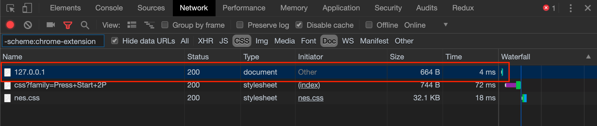
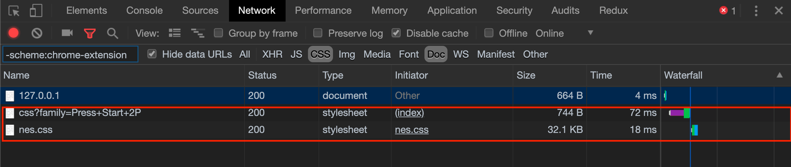
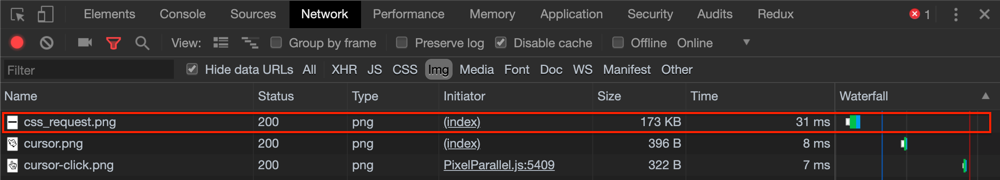
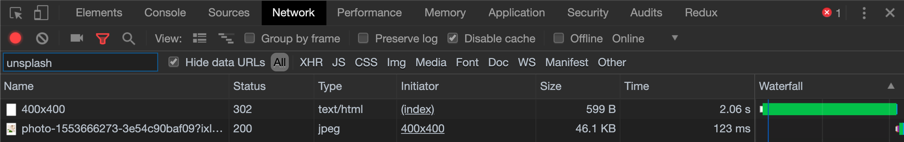

# Project Summary
---
Learn how assets are loaded and specified in html.

### Exercise 1: Create a webpage
---

**Step 1:**

**Summary** - Setup the bare minimum for a webpage

**Instructions:**

  - Create an `index.html` file.
  - Add the necessary markup to render the `index.html` file in a browser.
  - Open the page in your web-browser.


**Step 2:**

**Summary** - add link tags to request stylesheets

**Instructions:**

  - In the `<head />` tag in your index.html add two `<link />` tags that request the following style sheets.
    > [https://fonts.googleapis.com/css?family=Press+Start+2P](https://fonts.googleapis.com/css?family=Press+Start+2P)
    >
    > [https://unpkg.com/nes.css/css/nes.css](https://unpkg.com/nes.css/css/nes.css)

  - In the `<body />` tag of your html add a `<h1 />` tag that contains `NES is the best`.
  - Either serve your `index.html` with a web-server or point your browser to your `index.html` file.
  - Open your browser's development tools and go to the network tab.
  - Reload the page and look at the network request that your browser is making.
  - What's important here is understanding the order that the browser is downloading the assets for
    this webpage. You'll notice the first request we see is the browser downloading the HTML document,
    our `index.html`. All the browser knows at this point is there there is an HTML document at the address
    specified and that it is going to download and start parsing the HTML document.

   > 

  - As the browser is parsing the HTML document it encounters the `link` tags in the `head` of the document.
    The link tags tell the browser there are some stylesheet assets that also need to be fetched before it can
    continue parsing the document. You can see the style sheets being fetched here.

  > 

  - As you can see the assets are fetched in the order that they are encountered when parsing the HTML document,
    that is an important detail to remember going forward.

**Step 3:**

**Summary** - Add images

**Instructions:**

 - Add an `` tag to the `index.html` with the following `src` attribute
 > [./readme-assets/css_request.png](./readme-assets/css_request.png)

 - Open the browser development tools again, go to the network tab and filter
    it by `img` requests. You should now be able to see the network request made to fetch the `img`
    we just added.

  > 


  - As you're probably beginning to see, other files referenced in an HTML document are treated as
    assets and have to be downloaded by the browser in order to utilize those assets. We can also request
    assets from other servers that we don't own. Lets do that next.

  - Create another `` tag and set the `src` attribute to:
  > https://source.unsplash.com/random/400x400

  - There are a couple of interesting things about this asset we've specified as an image.
    - It's being requested using a full URL and it's querying a server we do not control `unsplash.com`.
    - We aren't requesting a specific image file.
    - Let's look at the network requests to see how the browser handles fetching this asset.

  > 

  - You'll notice there are two requests pertaining to the `unsplash` domain here. But we've only specified one
    URL in our html. There's a very good reason for that.
    - Notice that the first request made was to the src URL we used for the `img` tag. What is different here is
      that the server responded back to us with a `302` status code. This tells the browser that the resource
      its requesting is at another location.
    - The browser then makes another request to the location the server specified, that is the second request
      in this case, and it sends back a random image.
    - This is a great example of how a browser (client) and server interact and communicate over HTTP.

**Step 4:**

**Summary** - Add JavaScript

**Instructions:**

  - Above the closing `</body>` tag insert the following `<script />` tag.

    ```html
    <script type="application/javascript">
      console.log('HELLO FROM INLINE SCRIPT')
    </script>
    ```
  - Make sure you browser development tools are open and you're on the console tab.
  - Reload the page.
  - You should see the output `HELLO FROM INLINE SCRIPT` in the console.
  - The browser parsed the JavaScript defined in that script tag and ran it. But we can also declare
    a script like any other asset.
  - Now add the following `<script />` tag below the other.

    ```html
    <script src="scripts/hello.js" type="application/javascript"></script>
    ```

  - Reload your browser and look at the console output again. You should see `HELLO FROM SOURCED SCRIPT`
    in the console.
  - This script was loaded from our local `scripts` directory and then parsed and executed by the browser.


### Wrap Up

You should now have a basic understanding of how assets are declared and then fetched by the browser.
